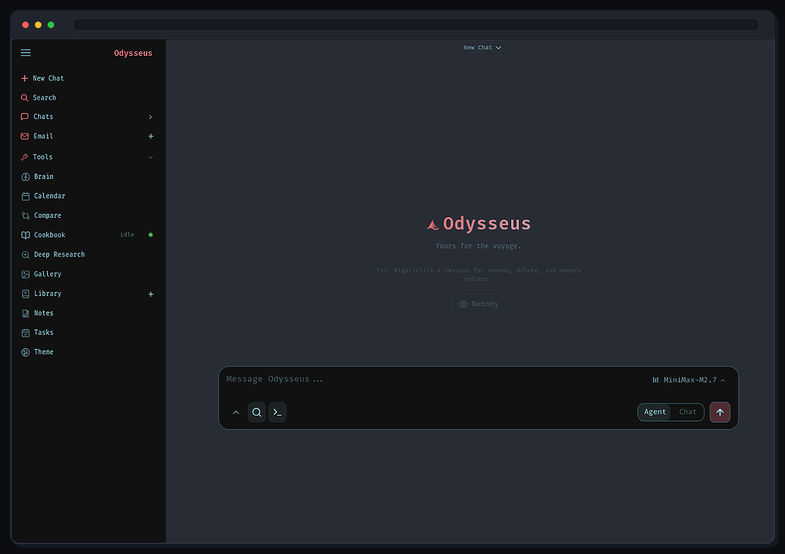

<p align="center">
  
</p>

<p align="center">
  A self-hosted AI workspace for chat, agents, research, documents, email, notes, calendar, and local model workflows.
</p>

<p align="center">
  <a href="#quick-start">Quick Start</a> ·
  <a href="website/setup.md">Setup Guide</a> ·
  <a href="CONTRIBUTING.md">Contributing</a> ·
  <a href="ROADMAP.md">Roadmap</a>
</p>

<p align="center">
  <a href="https://repology.org/project/odysseus-ai/versions"></a>
</p>

<p align="center">
  
</p>

---

> ### 🔱 Looking for this fork's customizations? They're on [`local-customizations`](https://github.com/plutado/odysseus/tree/local-customizations).
>
> **This `dev` branch is an unmodified mirror of upstream [odysseus-dev/odysseus](https://github.com/odysseus-dev/odysseus)** — kept in sync so the fork doesn't drift, and deliberately left clean so upstream merges stay conflict-free.
>
> All of the actual work lives on **[`local-customizations`](https://github.com/plutado/odysseus/tree/local-customizations)**, whose [README](https://github.com/plutado/odysseus/blob/local-customizations/README.md) documents every change. Highlights:
>
> - **Voice** — one-mic dictation with auto-stop, spoken replies with a real Kokoro voice picker, barge-in, answer-only speech (never the reasoning trace).
> - **App self-awareness** — the chat model knows what Odysseus is and, in agent mode, *acts* (creates notes/events, manages memory) instead of just describing, with a live snapshot of the workspace.
> - **Readability** — a two-tier font floor (16px primary / 14px minimum) across the whole app, driven by one CSS variable.
> - **Local-model fixes** — host-gateway endpoints detected as local; native tool-calling enabled for local Ollama; plus a recipe for running an **"Ajax"-style uncensored local model**.
> - **Email / Calendar** — inline images auto-load, correct number rendering, CalDAV sync-out defaults.
>
> Tuned for **Odysseus in Docker on macOS with the ML models running natively on the host** (Metal). Run it with:
> ```bash
> git clone -b local-customizations https://github.com/plutado/odysseus.git
> ```

---

## Quick Start

> `dev` is the default branch and gets the newest changes first. Use [`main`](https://github.com/odysseus-dev/odysseus/tree/main) if you want the more curated branch.

```bash
git clone https://github.com/odysseus-dev/odysseus.git
cd odysseus
cp .env.example .env
docker compose up -d --build
```

Open `http://localhost:7000` when the containers are healthy. The first admin password is printed in `docker compose logs odysseus`.

The compose files pull the official multi-arch image `ghcr.io/odysseus-dev/odysseus` (published by CI on every push to `main` and `dev`) and only build locally if the pull fails — so this also works on hosts without a build toolchain, e.g. as a [Portainer](https://www.portainer.io/) stack.

**Production deployments:** pin the immutable tag instead of `:latest`. `:latest` and bare `:X.Y.Z` tags move on every push to `main`, but `:X.Y.Z-<sha>` (e.g. `1.0.2-7c8070f`) always refers to one specific build:

```bash
ODYSSEUS_IMAGE=ghcr.io/odysseus-dev/odysseus:1.0.2-7c8070f docker compose up -d
```

Native installs, GPU notes, Windows/macOS instructions, HTTPS, and configuration live in the [setup guide](website/setup.md).

## Features

- **Chat + Agents** — local/API models, tools, MCP, files, shell, skills, and memory.
- **Cookbook** — hardware-aware model recommendations, downloads, and serving.
- **Deep Research** — multi-step web research with source reading and report generation.
- **Compare** — blind side-by-side model testing and synthesis.
- **Documents** — writing-first editor with AI edits, suggestions, Markdown, HTML, CSV, and syntax highlighting.
- **Email** — IMAP/SMTP inbox with triage, tags, summaries, reminders, and reply drafts.
- **Notes, Tasks + Calendar** — reminders, todos, scheduled agent tasks, and CalDAV sync.
- **Extras** — gallery/image editor, themes, uploads, web search, presets, sessions, and 2FA.

## Demo

A full hover-to-play tour lives on the [Odysseus landing page](https://odysseus-dev.github.io/odysseus/). Its source lives under [`website/`](website/).

## Contributing

Help is welcome. The best entry points are fresh-install testing, provider setup bugs, mobile/editor polish, docs, and small focused refactors. See [CONTRIBUTING.md](CONTRIBUTING.md) and [ROADMAP.md](ROADMAP.md).

## Security

Odysseus is a self-hosted workspace with powerful local tools. Keep auth enabled, keep private data out of Git, and do not expose raw model/service ports publicly.

- Keep `AUTH_ENABLED=true` for any network-accessible deployment.
- Keep `LOCALHOST_BYPASS=false` outside local development.

Deployment details are in the [setup guide](website/setup.md#security-notes).

## Star History

<a href="https://star-history.dera.page/#odysseus-dev/odysseus&type=date&legend=top-left">
 <picture>
   <source media="(prefers-color-scheme: dark)" srcset="https://star-history.dera.page/svg?repos=odysseus-dev/odysseus&type=date&theme=dark&legend=top-left" />
   <source media="(prefers-color-scheme: light)" srcset="https://star-history.dera.page/svg?repos=odysseus-dev/odysseus&type=date&legend=top-left" />
   
 </picture>
</a>

## License

AGPL-3.0-or-later -- see [LICENSE](LICENSE) and [ACKNOWLEDGMENTS.md](ACKNOWLEDGMENTS.md).
